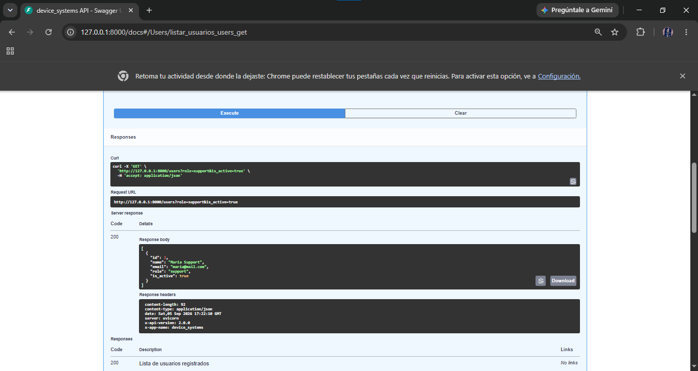
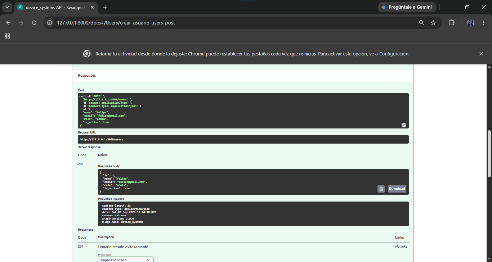
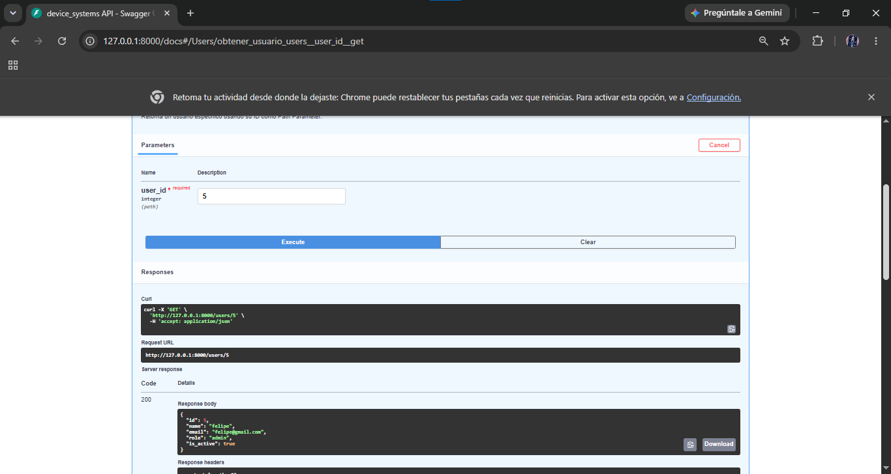
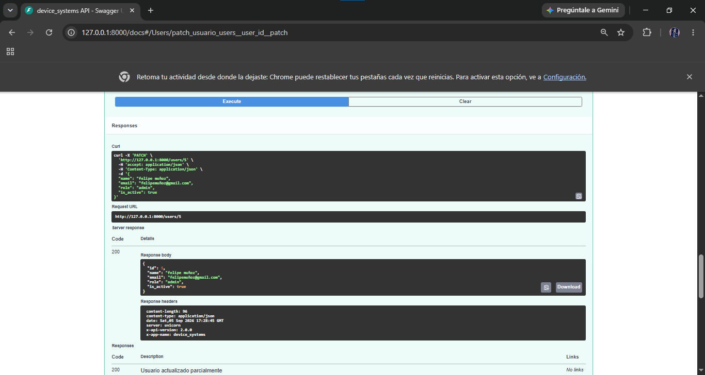
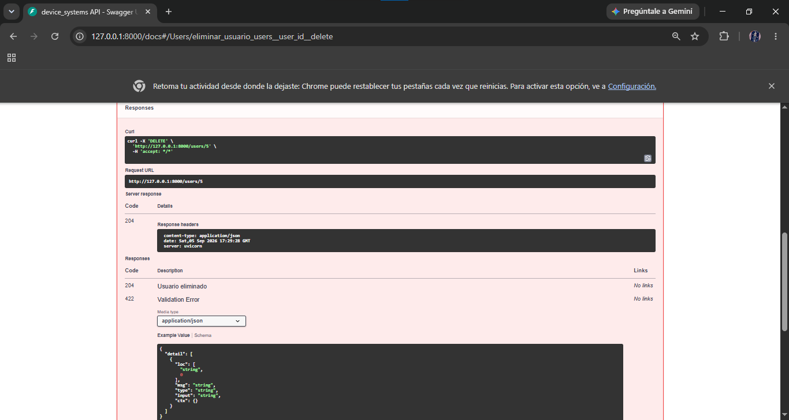
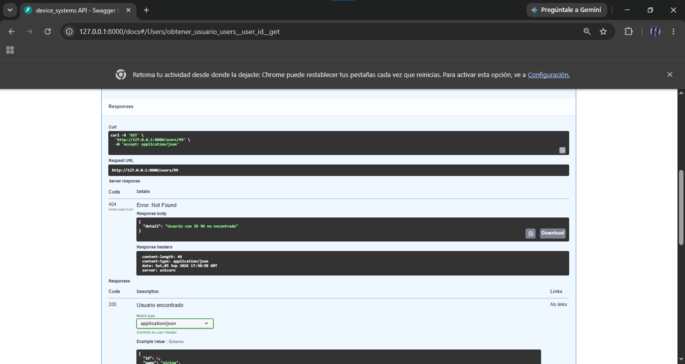
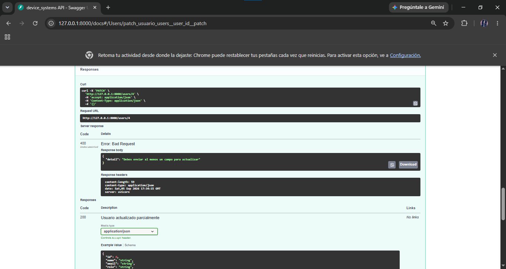
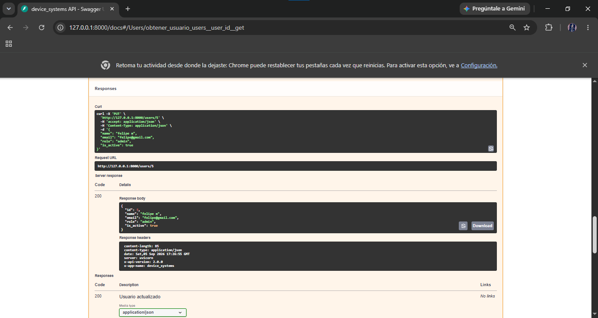
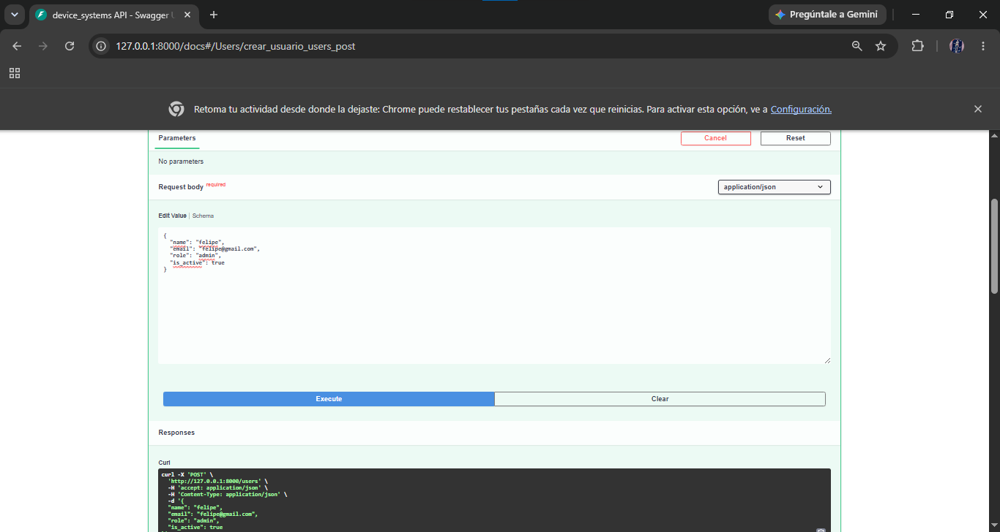
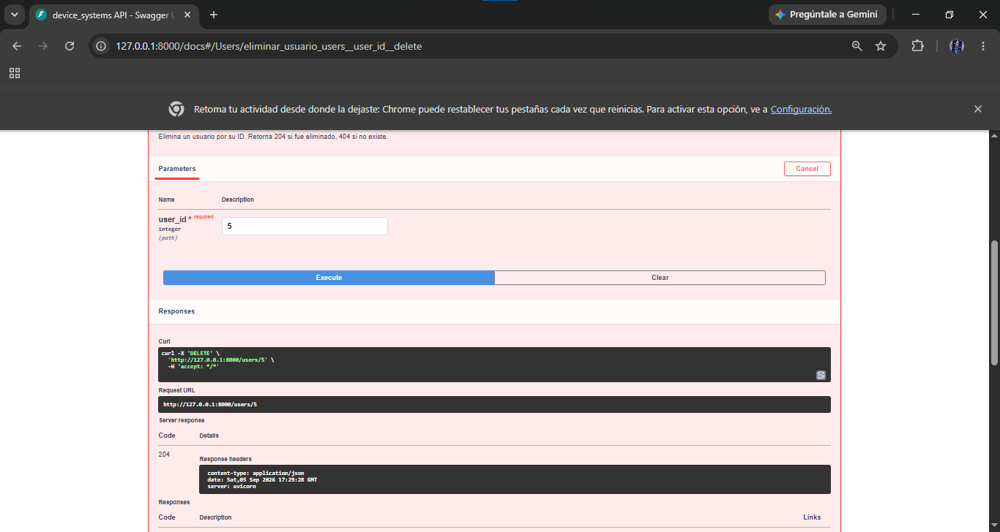

# device_systems

**GA1-220501096-01-AA1-EV07 – Fundamentos de FastAPI**

---

## Descripción

`device_systems` es una API REST construida con FastAPI para administrar usuarios del sistema. Permite listar, consultar, filtrar y registrar usuarios con validaciones de datos usando Pydantic v2.

---

## Instalación de dependencias

```bash
python -m venv venv
venv\Scripts\activate
pip install fastapi uvicorn pydantic[email]
pip freeze > requirements.txt
```

---

## Ejecución del servidor

```bash
uvicorn app.main:app --reload
```

El servidor queda disponible en:

- API: http://127.0.0.1:8000
- Swagger UI: http://127.0.0.1:8000/docs

---

## Estructura del proyecto

```
device_systems/
│── app/
│   │── main.py
│   │── schemas/
│   │   │── __init__.py
│   │   │── user_schema.py
│   │── routes/
│   │   │── __init__.py
│   │   │── user_routes.py
│   │── __init__.py
│── requirements.txt
│── README.md
```

---

## Tabla de endpoints

| Método | Endpoint                | Descripción               |
| ------ | ----------------------- | ------------------------- |
| GET    | `/`                     | Información de la API     |
| GET    | `/users`                | Lista todos los usuarios  |
| GET    | `/users/{user_id}`      | Obtiene un usuario por ID |
| GET    | `/users?role=admin`     | Filtra usuarios por rol   |
| GET    | `/users?is_active=true` | Filtra por estado activo  |
| POST   | `/users`                | Registra un nuevo usuario |

---

## Ejemplos de peticiones

### GET /users

```
GET http://127.0.0.1:8000/users
```

### GET /users/{user_id}

```
GET http://127.0.0.1:8000/users/1
```

### GET con filtro por rol

```
GET http://127.0.0.1:8000/users?role=admin
```

### GET con filtro por estado

```
GET http://127.0.0.1:8000/users?is_active=true
```

### POST /users

```json
POST http://127.0.0.1:8000/users
Content-Type: application/json

{
  "name": "Nicolas Munoz",
  "email": "nicolas@gmail.com",
  "role": "admin",
  "is_active": true
}
```

---

## Cabeceras HTTP personalizadas

Todos los endpoints retornan las cabeceras:

```
X-App-Name: device_systems
X-API-Version: 1.0
```

---

## Modelos Pydantic

### UserCreate (entrada)

| Campo     | Tipo     | Validación            |
| --------- | -------- | --------------------- |
| name      | str      | Mínimo 3 caracteres   |
| email     | EmailStr | Formato válido        |
| role      | str      | admin, support o user |
| is_active | bool     | True o False          |

### UserResponse (salida)

| Campo     | Tipo |
| --------- | ---- |
| id        | int  |
| name      | str  |
| email     | str  |
| role      | str  |
| is_active | bool |

---

## Reflexión

FastAPI permite construir APIs REST de forma rápida y segura. La integración con Pydantic garantiza que los datos siempre lleguen con el formato correcto, y la documentación automática con Swagger UI facilita las pruebas sin necesidad de herramientas externas.

## PANTALLAZOS

.png>)
.png>)
.png>)
.png>)
.png>)

**GA1-220501096-01-AA1-EV08 – FastAPI Intermedio**

---

## Descripción v2

Esta versión evoluciona la API inicial implementando CRUD completo, manejo profesional de errores, Dependency Injection y documentación automática con Swagger/OpenAPI.

---

## Nuevos endpoints v2

| Método | Endpoint           | Código | Descripción                 |
| ------ | ------------------ | ------ | --------------------------- |
| PUT    | `/users/{user_id}` | 200    | Actualizar usuario completo |
| PATCH  | `/users/{user_id}` | 200    | Actualizar usuario parcial  |
| DELETE | `/users/{user_id}` | 204    | Eliminar usuario            |

---

## Códigos de estado HTTP

| Código | Significado                                     |
| ------ | ----------------------------------------------- |
| 200    | OK - operación exitosa                          |
| 201    | Created - usuario creado                        |
| 204    | No Content - usuario eliminado                  |
| 400    | Bad Request - correo duplicado o PATCH vacío    |
| 404    | Not Found - usuario no existe                   |
| 422    | Unprocessable Entity - datos inválidos Pydantic |

---

## Estructura v2

device_systems/
│── app/
│ │── main.py
│ │── routes/user_routes.py
│ │── schemas/user_schema.py
│ │── services/user_service.py
│ │── dependencies/user_dependencies.py
│ │── data/users_db.py

---

## Dependency Injection con Depends()

Se implementaron dependencias reutilizables en `dependencies/user_dependencies.py`:

- `get_user_or_404` → busca usuario por ID, lanza 404 si no existe
- `validar_email_duplicado` → valida que el correo no esté repetido
- `get_api_config` → retorna configuración general
- `verificar_api_key` → simula autenticación por cabecera

Ejemplo de uso:

```python
@router.get("/{user_id}")
def obtener_usuario(usuario=Depends(get_user_or_404)):
    return usuario
```

---

## Manejo de errores

| Error                    | Código |
| ------------------------ | ------ |
| Usuario no encontrado    | 404    |
| Correo duplicado         | 400    |
| PATCH sin datos          | 400    |
| Datos inválidos Pydantic | 422    |

---

## Capturas Swagger UI v2










---

## Reflexión final

Evolucionar la API permitió entender cómo separar responsabilidades en capas. El uso de Dependency Injection evita repetir lógica y hace el código más limpio y mantenible.

## PANTALLAZOS









